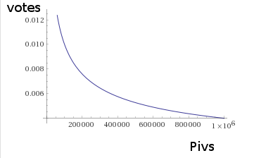
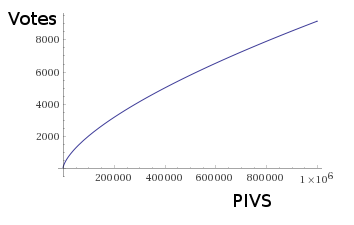

# PIVmetheus voting system proposal
PIVmetheus is compatible with, and essentially includes the Tango proposal.  
PIVmetheus is a long term plan while Tango is a short term plan. 

Wherever we begin, we and the world around us all will change with time. In subtle, complex and unpredictable ways.  
Like the performance of a long journey, the decisions that we make will determine where we end more so than the place of our beginning.  
Iteratively, the world will become a reflection of us, and we a reflection of the world.  
Our pathways shall be defined by the rules of the game, both imposed and chosen, understood and misunderstood.  
Because choosing a consensus model is choosing a fate, we believe that the nature of the consensus model chosen is extremely important. 
We believe it is worth the effort to build the model very carefully and very well. 

The system we are about to present is a result of the input of many PIVX community members.  It is based upon many years of study of voting system history and behavior. We argue that:  
* It uses the best information available, including high class mathematics. It is an agglomeration of more study, more effort, more expertise, and more contributors than the competing models. 
* It's the only model that successfully protects small investors. 
* It avoids historical voting system problems, and produces decisions that maximize the value and success of PIVX. 

From the perspective of the current Masternode owners, the shift in voting power under PIVmetheus will appear on the surface to be a loss of roughly 60% of their leverage. However, leverage is not always such a straight forward issue. The fact that a small group of individuals are in control of something can make that something less desirable. We expect the leverage to reappear for the Masternode owners as this model should raise the value of their holdings by means of helping to convince new investors that their investments are more safe with a model that protects them and grows their investments. 

We are confident that PIVmetheus will make an icon of PIVX for high class community decision making. 

## Fundamentals
Presstab presented an original 3 layer voting model, which was pointed in what many of us believed to be a good direction.  However, the model was not capable of protecting the small investors, which we expect to actually be most of the individuals involved in the community. Also, presstab's model attributed two layers to masternodes and stakers, but notably, masternodes and stakers fill nearly the same role in the system. Therefore, separating them into separate layers comes across as a nearly meaningless gesture.  

The first responsibility of an exchange medium is to protect value.  After a lengthy discussion, we realized that protecting the small investors of the community was the most daunting challenge we had to face. 
The problem is that the true bulk of investment and value in a cryptocurrency community is not actually currency, but the flesh and blood of the individuals who take part in the community.  The block chain however has no direct representation for an individual’s self, and no means of promising information about individuality or self-hood.  The information on the block chain is something of an illusion.  In order to make correct decisions, the voting model has to see through the illusion. 
 
Corporations originally did not see through the illusion of investment numerics. They generally chose a model comparable to the 1 piv = 1 vote model that is being presented by a different individual/group. That group claims to be protecting the small investors of the system, but the small investors don't hold enough PIVX to win decisions against larger investors. The historical result of this weakness in the corporate world was the labor movement.    http://www.history.com/topics/labor .  A recent attempt to (approximately) build the labor movement into the corporate voting model rather than having unions is “quadratic voting”.  https://papers.ssrn.com/sol3/papers.cfm?abstract_id=2264245  .  Quadratic voting reduces large investment dominance by giving people voting power according to the square root of their holdings. The message of quadratic voting is that ones holdings matter, but so does each individuals identity. 

While there is hope of using complex anonymous identity systems in the future for the protection of individuals, without explicit identity information, we can still use a strategy very similar to quadratic voting, which we will call “power voting”.  

Having multiple separate voting layers that differ from one another in character allows the voting process to effectively consider issues from multiple view angles in order to process them more completely. Power voting can create two distinct voting layers that favor small investors and large investors separately.  Unsavory features of “quadratic voting” were removed, and the details are discussed in the PIVmetheus white paper.  Here we will summarize by showing images.  

Power voting can substantially seperate large from small investors by offering vote power that changes with account (public key holding) size.  We will use two separate profiles.  One profile which favors small investors in voting power looks like the following image with votes per piv on the vertical axis and pivs on the horizontal axis.

The voting layer which favors large investors uses a votes/piv profile that looks like the following image. 

Playing favorites for small investors however, doesn’t work in anonymous systems, because large investors can simply pretend to be small investors in order to obtain the favor.  We can not eliminate the ability of large investors to do this. We can however eliminate the incentive by providing the same protection to large investors as is given to small investors.  A large investor who pretends to be a small investor will according to the scheme, lose large investor vote.  This means that pretending to be a small investor does not increase their leverage.  This eliminates most of the incentive for large investors to steal small investor vote.  The PIVmetheus white paper also describes a collection of additional means of subtly adjusting the system in order to powerfully discourage large investors from pretending to be small investors.  The most significant of which is using a slow accrual of voting power in order to discourage/prevent voting attacks and strategic vote re-positioning. 

If we examine the history of the labor movement, we may realize that the event was caused by misrepresentation of value in the voting system.  The workers had a great deal of value, but no vote. The misrepresentation of value created incorrect leverages in the system.  Therefore, we move forwards to build a more correct mental model of value to adhere to.  We assume that in the future, so long as we adhere to a correct value model in voting, PIVX will enjoy increased stability and value. 

Because PIVX is a network, We begin by recognizing what we call the network effect. https://en.wikipedia.org/wiki/Network_effect  .  The network effect places a great deal of value on the number of nodes in a network.  Under assumption of the network effect, the small investors would clearly dominate the voting rights because of their number.  However, the network effect does not describe all of the values of a network.  We move forwards to include the strength of the network connections and the versatility or intelligence of the network connections. 
Equations are provided in the PIVMetheus white paper, but for here, we shall simply create the concepts of the “network effect”  or N^2 layer, the “network strength” or S layer, and the “network intelligence” or I layer.  We stand at this position in a high degree of confidence that these concepts or layers genuinely represent the value of our network, and that by protecting them each separately, we achieve the primary goal of an exchange medium, which is to protect the value of the system. 

Next, we note that our power voting layer or group which favors small investors is a good representation of the concept of “network effect”.  We afford it the label: “network effect”  or N^2.  We feel confident that our power voting layer which favors large investors will often build and support the intelligence of the system. We label it the “intelligence” or I layer. We note that those who support the network function such as the Masternodes and Stakers, because of their similarity inherently belong together in the S or “network strength” layer.  At this point, we have identified a 3 layer model which correctly protects the value of our network. 
We further recognize at this point that while our exact voting maths and methods may vary, “network effect”, “network strength” and “network intelligence” will always remain legitimate descriptions of values to be protected.  Therefore, as we acquire new information and methods, we can retain a correct model by classifying voting power carefully under these three labels. 

If voting shows its self to be unreliable or “apathetic” for the network effect layer, Delegates, and delegated proof of stake may be built into “vote nodes” to support the weakness. 
Many have requested the construction of an “easy voting utility” to encourage voting by making the task much easier. This should be a part of future plans. 

## Voting Math
The fashion in which votes are weighted and combined has a huge impact on the behavior of the system. History has taught us some lessons regarding this issue.  Tweed voting https://www.youtube.com/watch?v=PJy8vTu66tE and the ravages of the two party system https://www.youtube.com/watch?v=s7tWHJfhiyo&list=PLPZwr9rnuY9pr4InUaLfjmX757UfE-DVY can be eliminated using iterative ranked voting.  This style of voting also allows the voters to chose between multiple solutions or proposals. 

Iterative, ranked voting also encourages individuals to vote their sincere opinions. Including a Null (do nothing) option into the ranked voting allows votes that can fail all of the options provided, simply by choosing “do nothing” as the favorite choice.  This option simultaneously provides crucial negative feedback into the voting system.   https://www.researchgate.net/publication/235766330_Restricted_Manipulation_in_Iterative_Voting_Convergence_and_CondorcetEfficiency  .  
To operate a must-choose vote, we need only to remove the null option. A ballot for three competing options may look something like this:
1. B
2. A
3. null
4. C

This configuration ranks B at the top. For layer blocking purposes, it counts B and A as positively voted (+1), and C as negatively voted (-1).  For the final vote, Iterative ranked voting removes losing options from the vote one at a time until only two options remain for comparison.  The removal of losing options and final comparison will be done by means of weighted copeland score.  The weights (relative significance of the vote for a specific public key) will be acquired for the S layer by examining the history of network support on the block chain. For the N^2 and I layers, the weights will be acquired from power voting mathematics as described in the PIVmetheus white paper.  

"Copeland: The score of candidate c is the number of pairwise comparisons she wins (i.e., contests between c and another candidate a such that there is a majority of voters preferring c to a) minus the number of pairwise comparisons she loses. The candidates with the highest score win." 

Delegate vote purchasing (bribes) can be stifled by limiting delegates (if instantiated) from representing more than 30,000 public keys. Furthermore, allowing voters to re-chose their own favorite delegate at any time will help to impose genuine representation onto the delegates. 

If we count votes ranked below “do nothing” as negative and those ranked above “do nothing” as positive, we can create an excellent means for each of the three layers to protect themselves by rejecting vote options with net negative vote count for that layer.  Such vote options would then not be allowed to proceed to the combined multi-layer vote where each layer of the system would receive equal weight (1/3) in the decision making process. 

For beginners, we can give Masternodes 50% of the S (network support) layer and stakers also 50%.  If it becomes necessary to build vote nodes for delegation, they would naturally also be counted into network support and acquire 5% of the S layer vote from both Masternodes and Stakers, totalling 10% of the S layer vote. 
Vote options which are not blocked by layers pass to the system wide iterative ranked vote where each layer (N^2,S,I)  receives 1/3 of the vote weight.  The winning option of that vote passes and is accepted by the PIVX community. 

## Calibration
Until we actually run the system, its behavior can not be entirely predicted.  Some have expressed fears of deadlock and other potential problems.  These kinds of issues are dealt with by means of tuning parameters.  Tuning parameters are slight adjustments to the voting math in order to perfect its behavior.  To begin with, for example, we will add 5% extra weight to the null (do nothing) option for the final vote counting.  This helps assure us that the proposals that are passed are high quality.  Each layer will also block proposal options on net negative vote count. In case of deadlock, this parameter could be adjusted, blocking could for example be moved back to -5% total layer vote in order to block. 

## Meta-Voting 
Meta-votes are just votes with special thresholding for the meta-vote purpose. These votes are allowed only to operate on the voting system or primary documents of the system its self such as the Manifesto and consensus model.  They can be used to tune/calibrate the system as described in that section. 
Any meta-vote operating on normal system decisions is invalid and not to be implemented. Any normal vote operating on the voting system or primary system documents is similarly invalid and not to be implemented.

In the case of meta-votes, the structure of the decision making system is in question. It's probably appropriate to have two separate sets of criteria for voting. One for the general manifesto, and a second for any other fundamental document. In both cases, the layer blocking option falls out, and macro-vote (combined vote, or final vote) dominates entirely. However, the null (do nothing) option receives 15% advantage for changes in the manifesto, and 10% advantage for changes in other core documents.
Because the consensus model and other core documents are assumed to be in a tuning phase for the first 8 years however, the 10% advantage for the null option shall (for alteration and tuning of the consensus model) be reduced to 5% for those 8 years.

## Onramp
Avoiding an identity model requires extra complexity in this system, which then imposes a step-wise implementation. A reasonable ordering of the steps for implementation is as follows. This schedule should be somewhat flexible, based on the needs of other projects and availability of coding talent.
1. Create an S layer by adding staking vote together to the currently used masternode vote. Also, the easy voter utility will be required up front. This is the rough equivalent of the Tango proposal. 
2. Create the N2 and I layers. Also create a software tool for observing the system behavior. 
3. Observe the system behavior for roughly 1 year. 
4. Re-tune parameters and add additional adjustments for protecting the small investor vote as appears to be appropriate.  These minor adjustments can be found in the PIVmetheus white paper. Adjust system design if necessary.  Vote delegation is one of these possible adjustments, that is a major adjustment that may be necessary at this time. 
5. Perfect the software tool for system observation.
6. Add more options for protecting the N^2 vote from the PIVX white paper if necessary.  Which options will be appropriate will best be decided in the future. 

## PIVmetheus white paper
This document describes the primary issues and function of the PIVmetheus voting system. For more complete and technical details regarding the voting system of this proposal, see the PIVmetheus white paper. 

## More References
https://en.wikipedia.org/wiki/Electoral_system
https://en.wikipedia.org/wiki/Social_choice_theory
https://en.wikipedia.org/wiki/Arrow%27s_impossibility_theorem
https://en.wikipedia.org/wiki/Gibbard%E2%80%93Satterthwaite_theorem
https://en.wikipedia.org/wiki/Cardinal_voting
https://en.wikipedia.org/wiki/Condorcet_paradox
http://www.cds.caltech.edu/%7Emurray/books/AM05/pdf/am06-complete_16Sep06.pdf

## Disclaimers

While this document often makes use of the traditional word "vote", it is important to understand that it only appears to be traditional voting from the users perspective. The internal maths will be in the form of weighted network feedback. This appears to be the only means of accomplishing all of the named goals in the document. Therefore, it is appropriate to replace the word "vote" with a phrase such as "inform" or "informing" or "information acquirement" or "decision making event". The use of the word "vote" is for mental convenience of the reader only, and the meaning of the word shall be switched to an altered state defined by this paragraph.

## Contributors 
The information and ideas required to build this document come from a large number of individuals. Many of the contributions are fine details, and only visible in the pivmetheus white paper.  

Turtleflax, Openbaringen, Nitya, Presstab, Alexanderluthor, cryptosi, Grant, derek_hansen, Trismegistus, mgshightech, eric_stanek, Dino85fr, fused_helios
